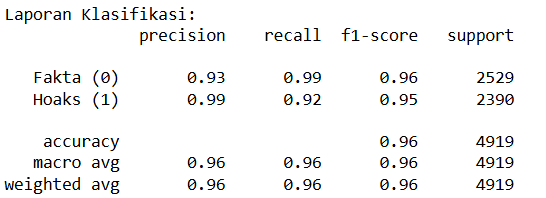
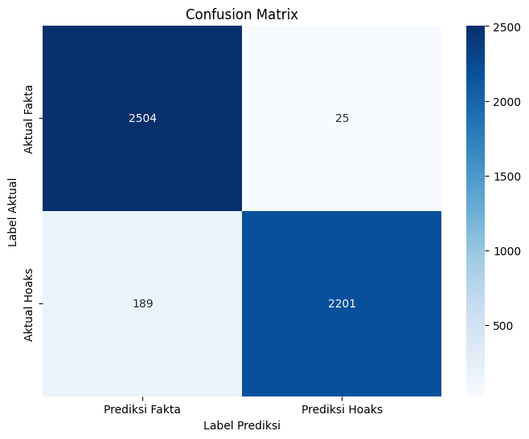
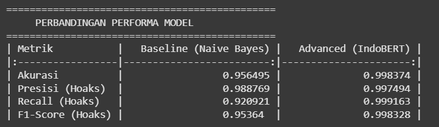

# Agen Deteksi Berita Hoax (Ril or Fek)

## Deskripsi
Proyek ini adalah sebuah studi kasus untuk membangun model *machine learning* yang mampu mengklasifikasikan artikel berita berbahasa Indonesia sebagai "Fakta" atau "Hoaks". Tujuannya adalah untuk menciptakan sebuah agen cerdas sebagai alat bantu dalam memerangi disinformasi digital.

## Masalah yang Diselesaikan
Penyebaran hoaks dan disinformasi di Indonesia merupakan masalah serius yang dapat mengancam stabilitas sosial dan pemahaman publik. Proyek ini bertujuan untuk mengembangkan sebuah solusi teknologi yang dapat membantu masyarakat memverifikasi informasi dengan lebih cepat dan mudah.

---

## Sumber Data
Proyek ini menggunakan dataset "Deteksi Berita Hoaks Indo Dataset" yang dikompilasi oleh Wersbo dan Mochamad Abdul Azis, tersedia di [Kaggle](https://www.kaggle.com/datasets/mochamadabdulazis/deteksi-berita-hoaks-indo-dataset). Sumber berita asli (CNN Indonesia, Kompas, Detik, TurnBackHoax.id). Dataset ini berisi ribuan artikel berita yang telah dilabeli dan melalui proses pembersihan awal.

## Temuan Awal dari EDA (Exploratory Data Analysis)
Analisis dilakukan pada sampel acak 30% dari total 24,592 artikel berita.

1.  **Distribusi Label Sangat Seimbang:**

    
    * **Fakta (Label 0):** 51.6%
    * **Hoaks (Label 1):** 48.4%
    * Keseimbangan ini sangat ideal untuk melatih model AI yang objektif.
2. **Pola Panjang Berita Teridentifikasi:**
    * Rata-rata jumlah kata untuk berita **Fakta** adalah **3,808 kata**.
    * Rata-rata jumlah kata untuk berita **Hoaks** adalah **3,570 kata**.
    * Ini menunjukkan bahwa berita hoaks dalam dataset ini cenderung sedikit lebih ringkas.

---

## Hasil & Evaluasi Model

### 1. Baseline Model (TF-IDF + Multinomial Naive Bayes)

Model dasar ini dibuat untuk menjadi titik acuan (benchmark) performa sebelum menggunakan model yang lebih kompleks. Dataset yang terdiri dari **24,592 artikel** dibagi menjadi **80% data latih (19,673 artikel)** dan **20% data uji (4,919 artikel)**.Model ini dilatih menggunakan representasi teks TF-IDF dan algoritma klasifikasi Multinomial Naive Bayes.

* **Akurasi pada Test Set:** **95.65%** 

**Laporan Klasifikasi:**

**Confusion Matrix:**

**Interpretasi Singkat:**
* Model dasar ini sudah menunjukkan performa yang sangat kuat dalam membedakan berita hoaks dan fakta.
* Dari **2,390 berita hoaks** yang ada di data uji, model **berhasil mendeteksi 2,201** di antaranya dengan benar (nilai *Recall* tinggi).
* Dari **2,390 berita yang diprediksi sebagai hoaks**, **2,201 di antaranya memang benar hoaks** (nilai *Precision* baik).

### 2. Advanced Model (Fine-tuned IndoBERT)

Untuk meningkatkan performa, model *Transformer* **Indobenchmark/IndoBERT** di-*fine-tune* selama 3 *epoch* pada dataset yang sama. Model ini dipilih karena kemampuannya memahami konteks dan nuansa Bahasa Indonesia secara mendalam.

### Proses Pelatihan & Pemilihan Model

Model di-*fine-tune* selama **3 epoch** penuh. Proses pelatihan ini dipantau secara saksama menggunakan data validasi di setiap akhir epoch untuk memilih versi model yang paling optimal dan menghindari *overfitting*.

Parameter `load_best_model_at_end=True` diaktifkan, yang secara otomatis akan memilih model berdasarkan skor **Validation Loss** terendah.

* **Model Tersedia di:** [**Lihat Model di Hugging Face Hub**](https://huggingface.co/faris27/indobert-hoax-detection)

* **Akurasi pada Test Set:** **99.84%**

**Laporan Klasifikasi:**

### **3. Perbandingan Performa Model**

Confusion matrix berikut merangkum perbandingan performa antara *Baseline Model* dan *Advanced Model* pada metrik-metrik kunci.

**Analisis:**
*Fine-tuning* IndoBERT secara signifikan meningkatkan semua metrik evaluasi. Peningkatan terbesar terlihat pada **Precision**, yang berarti model canggih ini jauh lebih baik dalam memastikan bahwa berita yang ia prediksi sebagai "Hoaks" memang benar-benar hoaks, sehingga mengurangi risiko "salah tuduh".

Seperti yang terlihat pada tabel, **Validation Loss** (tingkat kesalahan pada data baru) mencapai titik terendahnya di **Epoch 2**. Namun, di **Epoch 3**, meskipun *Training Loss* terus menurun (model semakin hafal data latih), *Validation Loss* justru kembali naik.

Ini adalah **indikator klasik dari *overfitting***, di mana model mulai kehilangan kemampuannya untuk menggeneralisasi.

Berkat konfigurasi `load_best_model_at_end=True`, *Trainer* secara cerdas **membuang model dari Epoch 3 dan secara otomatis menggunakan model dari Epoch 2** sebagai model final. Oleh karena itu, akurasi akhir sebesar **99.84%** yang didapat adalah hasil dari model yang paling optimal dan tidak *overfitting*.

---

## Rencana Pengembangan (Roadmap)
Proyek ini akan dikembangkan dalam beberapa fase:
1.  **Fase 1 (Selesai):** Fondasi, Pengumpulan Data, EDA, dan Pengembangan model awal (Baseline).
2.  **Fase 2 (Selesai):** Pengembangan Model (Advanced).
3.  **Fase 3:** Pengembangan Aplikasi Full-Stack (Backend & Frontend).
4.  **Fase 4:** Deployment dan Publikasi.

## Teknologi yang Digunakan
* **Analisis Data:** Python, Pandas, Matplotlib, Seaborn
* **Model AI:** Scikit-learn, PyTorch, Transformers (Hugging Face)
* **Backend:** FastAPI
* **Frontend:** React