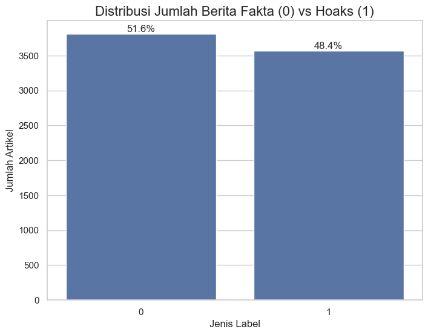
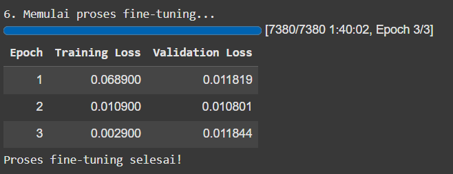
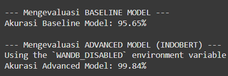
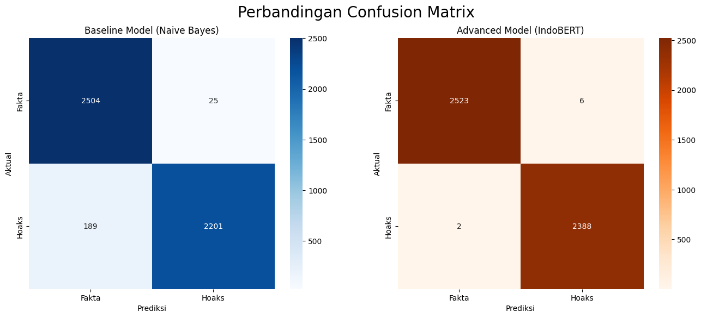

# 🤖 Ril or Fek - Aplikasi Deteksi Hoaks Berbasis AI

   

Aplikasi web full-stack yang mampu menganalisis teks berita berbahasa Indonesia dan memprediksi apakah berita tersebut hoaks atau fakta menggunakan model AI (IndoBERT) yang telah di-*fine-tune*.

**Live Demo:** [**rof.farisalfarizi.my.id**](https://rof.farisalfarizi.my.id/)

[](https://ril-or-fek-app-hef4z.ondigitalocean.app/)

[](https://ril-or-fek-app-hef4z.ondigitalocean.app/)


---

## 📜 Daftar Isi
* [Tentang Proyek](#-tentang-proyek)
* [Fitur Utama](#-fitur-utama)
* [Teknologi yang Digunakan](#️-teknologi-yang-digunakan)
* [Alur Kerja & Performa Model](#-alur-kerja--performa-model)
* [Cara Menjalankan Secara Lokal](#-cara-menjalankan-secara-lokal)
* [Proses Deployment](#️-proses-deployment)

---

## 📖 Tentang Proyek

"Ril or Fek" (Real or Fake) adalah proyek portofolio pribadi yang dibangun untuk mendemonstrasikan alur kerja *end-to-end* dalam menciptakan aplikasi berbasis AI. Proyek ini mencakup pengumpulan data, analisis data eksploratif (EDA), pelatihan model *machine learning* (klasik dan *deep learning*), pembuatan API backend, hingga pengembangan antarmuka pengguna (UI) yang interaktif dan responsif.

### Masalah yang Diselesaikan
Penyebaran hoaks dan disinformasi di Indonesia merupakan masalah serius yang dapat mengancam stabilitas sosial dan pemahaman publik. Proyek ini bertujuan untuk mengembangkan sebuah solusi teknologi yang dapat membantu masyarakat memverifikasi informasi dengan lebih cepat dan mudah.

---

## ✨ Fitur Utama

* **Analisis Teks AI:** Memprediksi berita hoaks/fakta dengan akurasi ~99.84%.

[](https://ril-or-fek-app-hef4z.ondigitalocean.app/)
* **Antarmuka Multi-Halaman:** Navigasi yang mulus antara halaman Analisis, Lacak Hoaks, Tentang Model, FAQ, dan Tentang Saya.

[](https://ril-or-fek-app-hef4z.ondigitalocean.app/)
* **Mode Terang & Gelap (Dark Mode):** Tampilan yang nyaman digunakan kapan saja, dengan preferensi yang tersimpan di perangkat pengguna.

[](https://ril-or-fek-app-hef4z.ondigitalocean.app/)
* **Pelacak Hoaks Dinamis:** Mengambil data hoaks terkini secara *real-time* dari RSS Feed Turnbackhoax.id.

[](https://ril-or-fek-app-hef4z.ondigitalocean.app/)
* **Desain Responsif:** Tampilan yang optimal di perangkat desktop maupun mobile.

[](https://ril-or-fek-app-hef4z.ondigitalocean.app/)
* **Interaksi Halus:** Animasi yang memanjakan mata saat berpindah halaman dan menampilkan hasil.

[](https://ril-or-fek-app-hef4z.ondigitalocean.app/)

---

## 🛠️ Teknologi yang Digunakan

<table>
  <tr>
    <td align="center"><strong>Frontend</strong></td>
    <td align="center"><strong>Backend</strong></td>
    <td align="center"><strong>Model AI</strong></td>
  </tr>
  <tr>
    <td>
      <ul>
        <li>React.js</li>
        <li>Vite</li>
        <li>Tailwind CSS</li>
        <li>Framer Motion</li>
      </ul>
    </td>
    <td>
      <ul>
        <li>Python</li>
        <li>FastAPI</li>
        <li>Uvicorn</li>
      </ul>
    </td>
     <td>
      <ul>
        <li>PyTorch</li>
        <li>Hugging Face Transformers</li>
        <li>IndoBERT (Fine-tuned)</li>
        <li>Scikit-learn</li>
      </ul>
    </td>
  </tr>
</table>

---

## 🧠 Alur Kerja & Performa Model

### 1. Sumber Data & EDA
Proyek ini menggunakan dataset "Deteksi Berita Hoaks Indo Dataset" dari [Kaggle](https://www.kaggle.com/datasets/mochamadabdulazis/deteksi-berita-hoaks-indo-dataset), yang bersumber dari Turnbackhoax.id, CNN Indonesia, Kompas, dan Detik.com. Analisis awal menunjukkan dataset seimbang (51.6% Fakta, 48.4% Hoaks) dan siap untuk pelatihan.



### 2. Perbandingan Model
Dua model dikembangkan untuk perbandingan:

* **Baseline Model (TF-IDF + Naive Bayes):** Mencapai akurasi **95.65%**.
* **Advanced Model (Fine-tuned IndoBERT):** Model utama yang digunakan di aplikasi. Model ini di-*fine-tune* selama 3 *epoch*, dan model terbaik dari **Epoch 2** dipilih secara otomatis untuk menghindari *overfitting*, menghasilkan akurasi final di data uji sebesar **99.84%**.





#### Confusion Matrix



Model yang sudah terlatih di-hosting di [**Hugging Face Hub**](https://huggingface.co/faris27/indobert-hoax-detection).

---

## 🚀 Cara Menjalankan Secara Lokal

Untuk menjalankan proyek ini di komputer Anda, ikuti langkah-langkah berikut:

### Backend
```bash
# 1. Masuk ke folder backend
cd backend

# 2. Buat dan aktifkan virtual environment
python -m venv venv
# Windows: venv\Scripts\activate
# Mac/Linux: source venv/bin/activate

# 3. Install semua dependensi
pip install -r requirements.txt

# 4. Jalankan server FastAPI
uvicorn main:app --reload
```
Server backend akan berjalan di http://127.0.0.1:8000.


### Frontend
``` bash
Buka terminal baru.

# 1. Masuk ke folder frontend
cd frontend

# 2. Install semua dependensi
npm install

# 3. Jalankan server pengembangan Vite
npm run dev
```
*Aplikasi frontend akan berjalan di http://localhost:5173

---

## ☁️ Proses Deployment

Aplikasi ini di-deploy menggunakan arsitektur multi-komponen di DigitalOcean App Platform.

* **Backend (Web Service):** Berjalan sebagai layanan web Python, di-hosting di instance Basic dengan 1 GB RAM untuk menangani pemuatan model AI.

* **Frontend (Static Site):** Dihasilkan dari proses ``npm run build`` dan disajikan sebagai situs statis.

* **Konektivitas:** Frontend terhubung ke backend menggunakan environment variable dan URL internal yang disediakan oleh DigitalOcean, memastikan komunikasi yang aman dan efisien.
